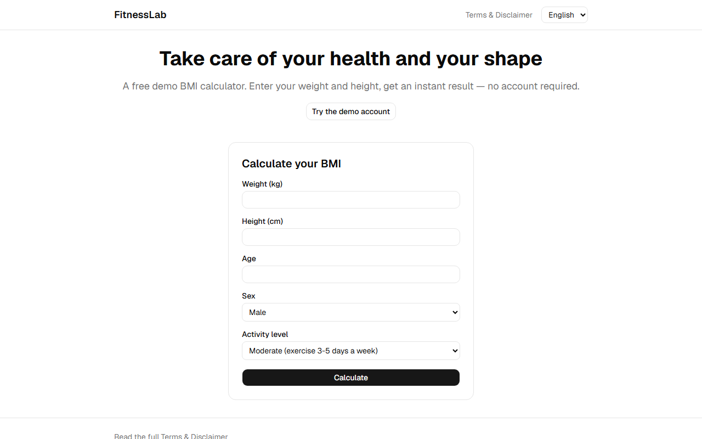
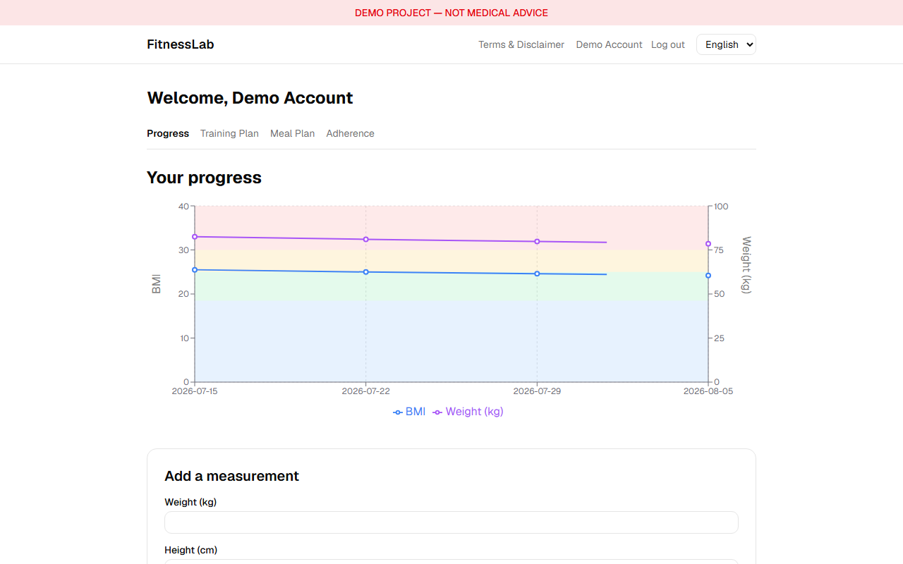
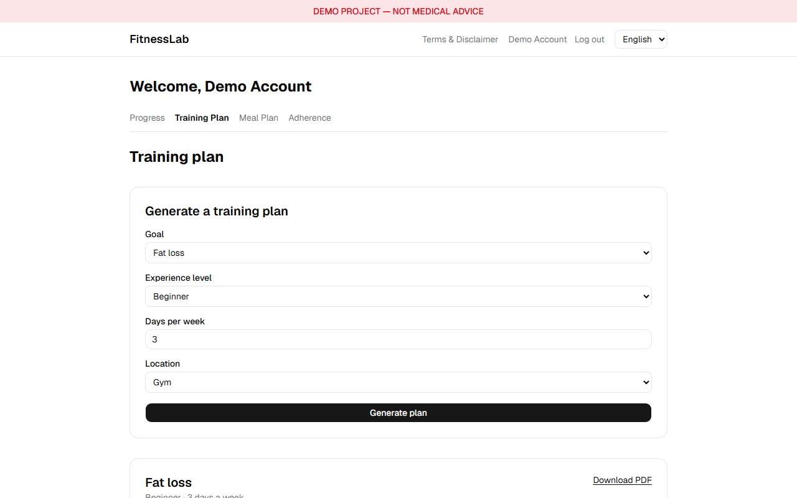
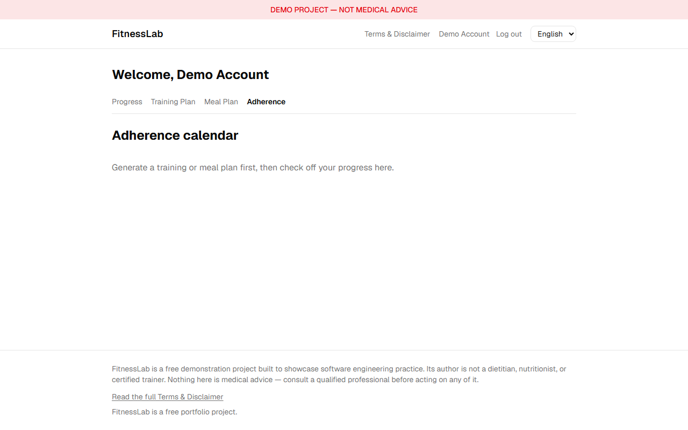

# FitnessLab

[](https://github.com/Zaitis/FitnessLab/actions/workflows/ci.yml)

**Take care of your health and your shape** — a full-stack demo application
built with Laravel and React.

🔗 **Live:** [fitnesslab.zaitis.dev](https://fitnesslab.zaitis.dev)

> ### ⚠️ Demo project — not medical advice
>
> FitnessLab is a **portfolio project**. It is not built or operated by a
> dietitian, nutritionist, or certified personal trainer. BMI results and
> the generated training and meal plans are produced by simple,
> hard-coded rules and exist **only to demonstrate software engineering
> practices** — they are **not medical, nutritional, or fitness advice**.
> Consult a qualified professional before changing your diet or training.
> The application is free, and provided "as is". See [Terms & Disclaimer](docs/legal/TERMS-AND-DISCLAIMER.md).

---

## What it does

The interface is bilingual — Polish and English, switchable at any time,
including for plans generated before the switch
([ADR-005](docs/adr/ADR-005-internationalisation.md)).

**Public landing page**
- Hero section with the project's purpose and a visible demo disclaimer.
- **Try the demo account** — one click into a populated dashboard, no
  registration required.
- **Anonymous BMI calculator** — no account required. Enter weight, height,
  age, sex, and activity level; get a BMI value and weight category with
  full validation. The BMI figure itself only uses weight and height — the
  rest is captured for the meal plan generator, which needs it for an
  accurate calorie target.
- After a result is shown, a call to action invites the visitor to create a
  free account to save the measurement and track progress. Registration is
  fully independent — an account can be created without using the calculator.

**Dashboard (authenticated)**
- **Training plan generator** — pick a goal (fat loss / muscle gain /
  maintenance), experience level, and available days per week; a plan is
  assembled from a curated exercise database using deterministic rules.
- **Meal plan generator** — the same approach for a sample calorie and meal
  split, informed by the goal and the latest BMI measurement.
- **Progress tracking** — weight and BMI history over time with a trend chart.
- **Adherence calendar** — a monthly calendar where individual meals and
  exercises are checked off day by day.
- **PDF export** — any generated plan downloads as a PDF carrying a diagonal
  watermark with the demo disclaimer.

**Everywhere**
- A disclaimer layer surfaces the same notice in the page header, on every
  generated plan, in the footer, and as the PDF watermark — from a single
  source of truth.
- Terms of use stating the application is a free demo.

## Engineering focus

The point of this codebase is *how* it is built, not the accuracy of its
fitness recommendations:

- **Testable domain logic.** Plan generation lives in framework-agnostic
  classes driven by the Strategy pattern — no business rules in controllers.
- **A real test pyramid.** Pest unit, feature, and architecture tests on the
  backend; Vitest + React Testing Library with MSW on the frontend;
  Playwright for the critical end-to-end paths. See [Testing](docs/TESTING.md).
- **Enforced boundaries.** Architecture tests fail the build when a
  controller touches the database directly or a domain module reaches into
  infrastructure.
- **Documented decisions.** Non-obvious or expensive-to-reverse choices are
  recorded as ADRs rather than left implicit.

## Tech stack

| Layer | Choice |
|---|---|
| Backend | Laravel 12, PHP 8.4, PostgreSQL 16 |
| Sessions, cache, queue | Redis |
| API auth | Laravel Breeze (API mode) on Sanctum, cookie-based SPA session |
| Frontend | React 19 + TypeScript (strict), Vite |
| Server state | TanStack Query |
| Forms | react-hook-form + zod |
| UI | Tailwind CSS + shadcn/ui |
| i18n | react-i18next, spatie/laravel-translatable |
| Charts / calendar | Recharts, react-day-picker |
| PDF | dompdf |
| Backend tests | Pest (unit, feature, architecture) |
| Frontend tests | Vitest, React Testing Library, MSW |
| E2E | Playwright |
| Quality gates | Larastan, Laravel Pint, oxlint, Prettier, `tsc --noEmit` |
| Infrastructure | Docker Compose, GitHub Actions CI, nginx + Let's Encrypt on a single VPS |

The demo runs on one server across two hosts —
`fitnesslab.zaitis.dev` for the SPA and `fitnesslab-api.zaitis.dev` for the
API. Both sit under one registrable domain, which the cookie-based session
requires ([ADR-004](docs/adr/ADR-004-deployment-topology.md)).

Full rationale for each choice, including the ones deliberately rejected,
is in [Tech Stack](docs/TECH-STACK.md).

## Screenshots

| | |
|---|---|
|  |  |
| Landing page — anonymous BMI calculator | Progress tracking |
|  |  |
| Training plan generator | Adherence calendar |

## Repository layout

```
FitnessLab/
├── backend/          Laravel API
├── frontend/         React single-page application
├── e2e/              Playwright end-to-end suite
├── docs/             Architecture, patterns, testing, ADRs, legal copy
├── .ai/              Engineering standards applied across the repo
└── docker-compose.yml
```

## Getting started

`docker-compose.yml` runs only the stateful services (Postgres, Redis, a
queue worker) — the backend and frontend run on the host via their own dev
servers, which is faster to iterate on than rebuilding a container per
change. See [`docker-compose.prod.yml`](docker-compose.prod.yml) for how the
same two apps run as built images in production, and
[`e2e/README.md`](e2e/README.md) if you want to run the full stack,
production-Dockerfile-and-all, locally.

```bash
docker compose up -d

cd backend
composer install
cp .env.example .env
php artisan key:generate
# .env.example defaults to sqlite; point it at the compose Postgres instead:
#   DB_CONNECTION=pgsql
#   DB_HOST=127.0.0.1
#   DB_PORT=5435
#   DB_DATABASE=fitnesslab
#   DB_USERNAME=fitnesslab
#   DB_PASSWORD=secret
php artisan migrate --seed
php artisan serve --port=8000

# in a second terminal
cd frontend
npm install
cp .env.example .env
npm run dev
```

The frontend dev server prints its own port (typically `5173`) — open that
in a browser. Backend tests: `cd backend && vendor/bin/pest`. Frontend
tests: `cd frontend && npx vitest run`. Full end-to-end suite, plus the two
real Docker-only bugs it caught: [`e2e/README.md`](e2e/README.md).

## Documentation

| Document | Contents |
|---|---|
| [Architecture](docs/ARCHITECTURE.md) | Module boundaries, request flow, data model, auth |
| [Design Patterns](docs/DESIGN-PATTERNS.md) | Patterns applied in the domain layer, and which were rejected |
| [Testing](docs/TESTING.md) | Test pyramid, what is covered at each level, CI gates |
| [Tech Stack](docs/TECH-STACK.md) | Every dependency and the reasoning behind it |
| [Roadmap](docs/ROADMAP.md) | Milestones and definitions of done |
| [Security Review](docs/SECURITY-REVIEW.md) | Full audit against the security baseline, findings and fixes |
| [ADRs](docs/adr/) | Architecture decision records |
| [Terms & Disclaimer](docs/legal/TERMS-AND-DISCLAIMER.md) | Source copy for the in-app legal pages |

## Status

✅ Feature-complete — all eleven roadmap milestones are done; see
[Roadmap](docs/ROADMAP.md) for the full history.

**Live now:** the BMI calculator (weight, height, age, sex, activity
level), account registration and login, measurement carry-over from an
anonymous session into a new account, progress tracking with a weight/BMI
trend chart, an admin error-log viewer, a training plan generator (fat
loss, muscle gain, or maintenance — strength exercises for gym or home,
plus cardio), a meal plan generator (a 7-day, 5-meal-a-day plan with a
daily calorie and rough macro target from a real BMR estimate), an
adherence calendar for checking off individual meals and exercises day by
day, a demo account, and PDF export for any generated plan. A Playwright
suite covers the four critical end-to-end journeys as a CI gate, running
against the same Docker images production runs.

### Demo account

No registration needed — log in directly with:

| | |
|---|---|
| Email | `demo@fitnesslab.zaitis.dev` |
| Password | `FitnessLabDemo!2026` |

Or use the **Try the demo account** button on the landing page. The account
resets to its seeded state (a measurement history, a training plan, a meal
plan, and a partially checked-off adherence calendar) every night — nothing
a visitor does there persists or affects the next visitor. Its password,
email, and the account itself cannot be changed or deleted, by design (see
[Architecture](docs/ARCHITECTURE.md)).

## License

MIT — see [LICENSE](LICENSE).
