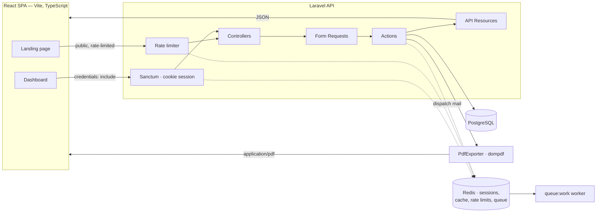
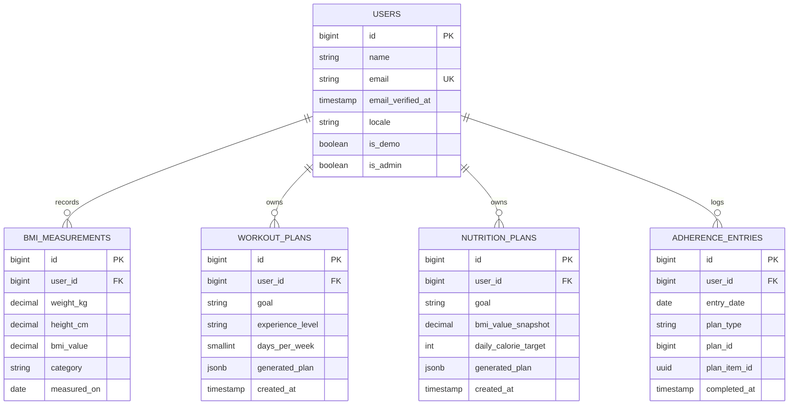

# Architecture

FitnessLab is a Laravel API paired with a separate React single-page
application, kept in one monorepo. The backend is a modular monolith:
one deployable unit with explicit boundaries between domain areas, in
line with `.ai/architecture.md` — monolith first, no speculative
flexibility, boundaries that make a future split *possible* rather than
*prepaid*.

## System overview



In production the two frontends of this diagram are distinct hosts —
`fitnesslab.zaitis.dev` for the SPA and `fitnesslab-api.zaitis.dev` for the
API — served by one nginx instance on one VPS
([ADR-004](adr/ADR-004-deployment-topology.md)).

## Module boundaries

The backend is organised by domain area rather than by technical type.

| Module | Responsibility | Representative classes |
|---|---|---|
| `Measurements` | BMI calculation and measurement history | `CalculateBmiAction`, `Bmi`, `BmiCategory`, `BmiMeasurement` |
| `Workouts` | Training plan generation from the exercise catalogue | `GenerateWorkoutPlanAction`, `WorkoutPlanStrategy` implementations |
| `Nutrition` | Meal plan generation from the meal template catalogue | `GenerateNutritionPlanAction`, `NutritionPlanStrategy` implementations |
| `Adherence` | Daily check-offs of planned meals and exercises | `ToggleAdherenceAction`, `AdherenceEntry` |
| `Documents` | PDF rendering and watermarking | `ExportPlanToPdfAction`, `PdfExporterInterface` |
| `Disclaimers` | Single source of truth for demo/legal copy | `DisclaimerText` |
| `Auth` | Registration, login, SPA session | Laravel Breeze + Sanctum |

## Code layout

Modules are cut vertically by domain, then horizontally into three rings.
The rings are what make the testing claims in [Testing](TESTING.md)
enforceable rather than aspirational — "the domain is framework-free" is only
meaningful if there is a namespace where that is literally true and a test
that proves it.

```
app/
├── Domain/<Module>/          pure PHP — no Illuminate whatsoever
│   ├── ValueObjects/         Bmi, Weight, Height, BmiCategory
│   ├── Criteria/             WorkoutPlanCriteria, NutritionPlanCriteria
│   ├── Strategies/           WorkoutPlanStrategy + implementations
│   └── Contracts/            ExerciseCatalogue, PdfExporterInterface
├── Application/<Module>/     use cases; may touch Eloquent and the container
│   └── Actions/              GenerateWorkoutPlanAction, ToggleAdherenceAction
├── Infrastructure/           adapters that satisfy Domain contracts
│   ├── Persistence/          Eloquent models, EloquentExerciseCatalogue
│   └── Pdf/                  DompdfPlanExporter
└── Http/                     Controllers, Form Requests, API Resources
```

Dependencies point inward only: `Http` → `Application` → `Domain`, with
`Infrastructure` implementing interfaces that `Domain` declares. `Domain`
depends on nothing but PHP itself.

Rules enforced by architecture tests:

- `App\Domain` may not use `Illuminate\*` — the whole framework, not just HTTP.
- `Workouts` and `Nutrition` never reference `Documents` or `Auth` internals.
- No module imports another module's Eloquent models; cross-module
  communication goes through Actions and typed data objects.
- Controllers contain no queries and no business rules.

### How generators reach the catalogue

The exercise and meal catalogues live in the database, but the strategies
that select from them are pure domain objects. These are reconciled by a
read-only contract declared in `Domain` and implemented in `Infrastructure`:

```php
interface ExerciseCatalogue
{
    public function matching(ExerciseFilter $filter): ExerciseCollection;
}
```

Strategies depend on the interface. In unit tests an in-memory
implementation is injected, so the generation rules — the part worth
testing hardest — run with no database at all. In production
`EloquentExerciseCatalogue` satisfies the same contract.

This is not the repository pattern that
[Design Patterns §4](DESIGN-PATTERNS.md) rejects, and the distinction is
deliberate: this is one narrow read interface per catalogue, introduced
against a concrete need that already exists, rather than a CRUD abstraction
per aggregate introduced against a hypothetical second data store. Plans,
measurements, and adherence entries are still persisted through Eloquent
directly inside Actions, with no interface in between.

## Request flow

A representative write path — `POST /api/workout-plans`:

1. **Sanctum middleware** resolves the session cookie, or returns `401`.
2. **Controller** does three things only: validate, call the Action, return
   a Resource. No branching on domain state.
3. **Form Request** validates `goal`, `experience_level`, `days_per_week`,
   and performs authorization in `authorize()`.
4. **Action** runs the domain logic: selects a strategy, assembles a plan
   from the exercise catalogue, and persists a snapshot. It has no knowledge
   of HTTP, which is what makes it unit-testable in isolation.
5. **API Resource** serialises the response and attaches the disclaimer text.

## Public vs. authenticated surface

The landing-page calculator must work without an account, but persistence
must not. This splits BMI into two endpoints backed by the *same* domain
Action:

| Endpoint | Auth | Behaviour |
|---|---|---|
| `POST /api/bmi/calculate` | public, rate-limited | Stateless. Calculates and returns a result. Writes nothing. |
| `POST /api/measurements` | `auth:sanctum` | Persists a measurement against the authenticated user. |

The public endpoint is throttled per IP because it is unauthenticated and
computationally trivial — an obvious abuse target that costs nothing to
protect (`.ai/security.md`).

### Carrying an anonymous result into a new account

A visitor who calculates BMI and then registers should not have to retype
their numbers. The result is held in `sessionStorage` on the frontend and
submitted to `POST /api/measurements` immediately after the first
authenticated request succeeds.

The alternative — persisting anonymous measurements server-side against a
guest token and reassigning ownership at registration — was rejected: it
creates unowned rows that need expiry and cleanup, and adds a claim
mechanism that has to be secured against enumeration. The client-side
approach costs one extra request and no schema at all.

## Data model



Alongside these, two seeded catalogue tables hold the rules the generators
draw from: `exercises` and `meal_templates`. These are reference data, not
user data. Their user-visible fields — name, description, instructions — are
JSONB translation columns holding every supported locale
([ADR-005](adr/ADR-005-internationalisation.md)).

One further table, `error_logs`, is owned by no domain module and belongs to
none of them — it holds captured application errors for the admin viewer
described below.

### Why generated plans are JSONB snapshots

A generated plan is the *output of the rules at a point in time*. The
catalogue behind it will change as exercises and meal templates are added
or corrected. Storing a snapshot means history and PDF exports always show
exactly what the user was given, instead of silently re-deriving a
different plan later. Recorded as [ADR-003](adr/ADR-003-plan-snapshots.md).

### Adherence and stable item IDs

Because plans are snapshots, every meal and exercise inside a snapshot is
assigned a UUID at generation time. `adherence_entries.plan_item_id`
references that UUID, which is what lets a check-off survive catalogue
changes and keeps the calendar decoupled from plan structure.

A unique constraint on `(user_id, entry_date, plan_item_id)` makes
double-logging impossible at the database level rather than relying on
application checks (`.ai/laravel.md` — prefer database-level constraints).

## Authentication

Two complementary packages, which is how Laravel structures authentication:

- **Sanctum** in **SPA mode** provides the mechanism — a session cookie plus
  CSRF token, not bearer tokens. FitnessLab's frontend is first-party, so
  there is no third-party client to issue API tokens to, and cookies keep
  credentials out of `localStorage` where XSS could reach them.
- **Breeze (API mode)** provides the endpoints on top: registration, login,
  logout, password reset, and email verification, as JSON with no Blade
  views.

Passport, Fortify, and Jetstream were considered and rejected;
[ADR-002](adr/ADR-002-spa-cookie-auth.md) records the reasoning and what each
package actually does.

### Session flow

1. The SPA calls `GET /sanctum/csrf-cookie` once, receiving the CSRF cookie.
2. `POST /login` authenticates and sets the session cookie, which is
   `HttpOnly` and therefore unreadable by JavaScript.
3. Every subsequent request sends `credentials: 'include'` and echoes the
   CSRF token in the `X-XSRF-TOKEN` header.
4. `GET /api/user` resolves the current user; the SPA models this as a
   TanStack Query query rather than a client-side store, so there is one
   cache and no chance of client and server disagreeing about who is signed
   in.

Session state itself lives in **Redis**, not on local disk, so sessions
survive container replacement and remain consistent across PHP-FPM workers.

Operationally this requires `SANCTUM_STATEFUL_DOMAINS` to name the SPA host
exactly, CORS with `supports_credentials: true`, and `SESSION_DOMAIN` scoped
so both hosts receive the cookie — which carries the trade-off documented in
[ADR-004](adr/ADR-004-deployment-topology.md).

## Redis

One Redis instance backs four concerns, each with a FitnessLab-specific key
prefix:

| Concern | Why it cannot be per-process |
|---|---|
| Sessions | File-based sessions are lost on redeploy and unshared across workers |
| Rate limiting | Per-worker counters would multiply the effective limit on `POST /api/bmi/calculate` by the worker count |
| Cache | Disclaimer text and the exercise/meal catalogues: read constantly, changed rarely |
| Queue | Breeze's outbound mail (password reset, email verification) must not block the request |

PDF export deliberately stays synchronous — see
[Tech Stack](TECH-STACK.md) for the measured threshold that would change
that.

## Internationalisation

The interface is bilingual, Polish and English. Text reaches the user from
three places, each handled differently:

| Source | Mechanism |
|---|---|
| Interface copy | `react-i18next`, JSON resource files per locale |
| Validation and framework messages | Laravel `lang/` files, Polish from `laravel-lang` |
| Exercise and meal catalogues | JSONB translation columns via `spatie/laravel-translatable` |

`config/supported_locales.php` is the single list both applications read, so
the backend and frontend cannot disagree about which languages exist.

**Locale resolution order:** an authenticated user's persisted `locale`
column, then the `Accept-Language` header sent by the SPA, then English as
the fallback. The language switcher writes to `localStorage` for anonymous
visitors and to the user record once signed in.

**Plan snapshots carry every locale.** A generated plan embeds the catalogue
text for all supported languages at generation time, so switching language
re-renders even plans created months earlier — without re-deriving them from
a catalogue that has since changed. This is what reconciles full
bilingualism with the immutability guarantee in
[ADR-003](adr/ADR-003-plan-snapshots.md); the reasoning is in
[ADR-005](adr/ADR-005-internationalisation.md).

## The demo account

A reviewer should reach a populated dashboard without registering. A seeded
`is_demo` user ships with measurement history, generated plans of both kinds,
and a partially filled adherence calendar, reachable from a *Try the demo
account* button on the landing page.

Because its credentials are public, the account needs constraints that a
normal user does not:

- **Destructive account actions are blocked.** A middleware rejects password
  changes, email changes, and account deletion for `is_demo` users —
  otherwise the first visitor to change the password locks out everyone
  after them.
- **State resets on a schedule.** A nightly scheduled job truncates the demo
  user's data and re-seeds it, so accumulated edits from visitors do not
  degrade the experience. This is what the scheduler container exists for.
- **It is a real user row**, not a bypass. It authenticates through the same
  Breeze and Sanctum path as anyone else, so no alternate login route exists
  to secure or to get wrong.

## Outbound mail

Transactional mail — password reset and email verification from Breeze —
sends from `fitnesslab@zaitis.dev` through the existing SMTP service on
`zaitis.dev`, using Laravel's standard SMTP driver. All of it is queued
rather than sent inline.

Deliverability is a deployment concern rather than an application one, and
an unglamorous but load-bearing one: without **SPF, DKIM, and DMARC** records
on `zaitis.dev`, password-reset mail is filtered as spam and the demo appears
broken to anyone who tries to recover an account. Verifying those records is
an explicit item in M0, not an afterthought at launch.

Email verification is deliberately **not** enforced as a gate on using the
application. A demo whose dashboard is unreachable until an email arrives is
a demo held hostage by a spam filter; the verification flow is implemented
and exercised, but unverified accounts retain access.

## Error visibility

Once the application is live from M4, a failure that nobody sees is a failure
that stays. Container stdout scrolls away on restart, and reading files over
SSH is not something anyone does habitually.

The chosen mechanism is deliberately small: a Laravel `stack` log channel
writing `error` and above to **both** the daily file and an `error_logs`
table, with an admin-only viewer in the dashboard. No external service.

Stacking the two channels matters. A database-only channel goes blind
precisely when the database is what broke, which is when the log is most
needed — the file channel is the fallback that still works then.

**A log viewer is an attack surface, not a convenience.** Application logs
routinely contain stack traces, request payloads, email addresses, and
occasionally credentials that ended up somewhere they should not. Publishing
that over HTTP demands the same rigour as any other endpoint:

- Access is granted by an `is_admin` policy, not by an unguessable route.
  Obscurity is not authorization, and a test asserts a non-admin receives
  `403`.
- The context payload is redacted before it is written — password, token,
  `Authorization`, and cookie values never reach the table at all. Redacting
  on write rather than on display means a later change to the viewer cannot
  leak what was never stored.
- Entries are pruned on a retention window by the scheduler, which bounds
  both table growth and how long incidental personal data survives.

**Why not Sentry or an equivalent.** For an application with one server, one
maintainer, and no paying users, an external error service adds an account,
a DSN, a vendor relationship, and a data-processing question about shipping
logs off-domain — to solve a problem a database table and a paginated list
already solve. The trade is real and it is being made knowingly: there are no
alerts, no aggregation, and no release tracking. Nobody is paged, because
nobody is on call.

## The disclaimer layer

The demo disclaimer must appear in four places that change for entirely
different reasons: the React header, the React footer, every plan JSON
response, and the PDF watermark. Duplicating the string across four
codepaths guarantees they drift apart.

One source of truth — `config/disclaimer.php`, wrapped by a `DisclaimerText`
value object — is consumed by:

- `GET /api/disclaimer`, a public cached endpoint the SPA reads once for
  header and footer copy;
- `WorkoutPlanResource` and `NutritionPlanResource`, which attach it to
  every plan payload;
- `PdfExporterInterface` implementations, which render it as the watermark.

The canonical wording lives in
[Terms & Disclaimer](legal/TERMS-AND-DISCLAIMER.md).

## Deviation from stack defaults

`.ai/architecture.md` defaults to a Laravel monolith with React added only
where interactivity demands it — which points at Inertia or Blade with
React islands. The fully separated API + SPA split adopted here is a
deliberate deviation, recorded in
[ADR-001](adr/ADR-001-api-spa-split.md).
